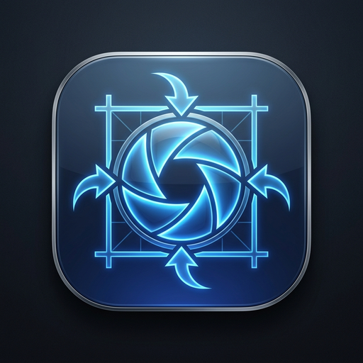

# 🖼️ Universal Image Toolkit

<div align="center">



**A modern, fast, cross-platform, and portable desktop suite for image resizing, cropping, compression, and multi-format conversion.**

[](https://www.python.org/)
[](LICENSE)
[]()
[](https://pytest.org)
[](https://peps.python.org/pep-0008/)

</div>

---

## 🌟 Overview

**Universal Image Toolkit** is an open-source, offline-first, native desktop image processing utility built with **Python**, **CustomTkinter**, and **Pillow**. It eliminates the need for heavy, bloated photo editors or cloud converters that compromise privacy.

It runs seamlessly across **Windows**, **macOS**, and **Linux** as either an installed environment or a **100% standalone, single-file portable executable (`.exe` / `.app` / binary)** that runs straight from a USB drive without requiring Python or external runtimes.

---

## ✨ Key Features

### 🎯 1. Interactive Visual Canvas
- **Visual Crop Box**: Drag-and-drop bounding box with 8 interactive resize handles and center-move dragging.
- **Rule-of-Thirds Grid**: Built-in photographic framing grid overlay.
- **Aspect Ratio Presets**: `Freeform`, `1:1 Square (Instagram)`, `16:9 Landscape (YouTube)`, `9:16 Story / Reel / TikTok`, `4:3 Standard`, `4:5 Portrait`, `3:2 Classic Photo`, `2:1 Ultrawide Banner`.
- **Viewport-Clipped Rendering**: High-performance rendering engine that only processes visible canvas regions, preventing memory spikes when zooming into massive multi-megapixel images.
- **Precision Zooming**:
  - Smooth, dampened trackpad and mouse wheel zooming.
  - **Editable Zoom Input**: Type any exact percentage (`50%`, `125%`, `300%`) directly into the toolbar.
  - Dedicated **Fit to Screen** and **1:1 Actual Size** toggles.
  - Right-click / Middle-click drag for instant panning.

### 📏 2. Smart Resizing
- **Exact Pixel Dimensions**: Width × Height inputs linked with an instant **Lock Aspect Ratio** toggle.
- **Percentage Scaling**: Scale from `10%` to `200%` with real-time dimension feedback.
- **One-Click Presets**: **4K (3840×2160)**, **1080p Full HD**, **720p HD**, **Square (1080×1080)**, **Story (1080×1920)**, and **Thumbnail (400×400)**.
- **Industry-Standard Resampling Filters**:
  - `Lanczos (High Quality)`: Best for downsampling photos with sharp details.
  - `Bicubic (Balanced)`: Smooth gradients and standard scaling.
  - `Bilinear (Fast)`: Quick approximations.
  - `Nearest Neighbor`: Crisp, pixel-perfect scaling for pixel art and icons.

### 🗜️ 3. Advanced Compression & Multi-Format Converter
- **Supported Export Formats**:
  - `JPEG / JPG`: Quality slider (`1–100%`), progressive encoding, and Huffman optimization.
  - `PNG`: Compression levels (`0–9`) + **Color Palette Reduction (2–256 colors)** for up to 80% smaller PNGs.
  - `WebP`: Next-gen web compression with Lossy & Lossless toggles.
  - `AVIF`: Ultra-efficient modern format.
  - `ICO`: Multi-resolution Windows icon generator (`16×16` up to `256×256`).
  - `PDF`: Direct image-to-PDF document packaging.
  - `BMP` & `TIFF`: Uncompressed and LZW lossless workflows.
  - `GIF`: Optimized single-frame/static exports.
- **Live Output Estimation**: Calculates the estimated file size and disk savings percentage in real time as you adjust quality sliders.
- **Auto-Fit Target Size**: Binary search optimizer that automatically calculates the highest possible quality level to stay under a specific file budget (e.g. `< 500 KB`).
- **EXIF & Metadata Stripper**: Automatically strips sensitive GPS and camera metadata for smaller sizes and complete privacy.

### ⚡ 4. High-Throughput Batch Processing
- **Queue Manager**: Add multiple image files or entire folder hierarchies.
- **Multi-Threaded Engine**: Non-blocking background worker pool so the UI stays responsive while processing hundreds of images.
- **Unified Batch Settings**: Apply simultaneous format conversion, resolution constraints, EXIF stripping, and compression to the entire queue.
- **Progress Tracking**: Real-time progress bar, status metrics, and summary report showing total disk space saved.

### 🎨 5. Modern UI & Dark/Light Themes
- Clean, high-contrast dark and light themes with curated color tokens.
- Undo history stack (`Cmd+Z` / `Ctrl+Z`) and instant **Revert to Original** button.
- Custom-designed cross-platform app icon.

---

## 📁 Project Architecture

```
universal-image-toolkit/
├── app.py                     # Main application entry point & CLI launcher
├── assets/                    # Application icons & graphics
│   ├── icon.png               # Master 512x512 PNG
│   ├── icon.ico               # Multi-size Windows icon
│   └── icon.icns              # macOS Apple icon bundle
├── engine/                    # Core Image Processing Subsystem
│   ├── __init__.py
│   ├── processor.py           # Transformations (Resize, Crop, Rotate, Flip, Filters)
│   ├── format_handler.py      # Multi-format exporters & palette quantizers
│   └── optimizer.py           # Live byte estimator & target-size auto-tuning
├── ui/                        # Desktop Interface (CustomTkinter)
│   ├── __init__.py
│   ├── theme.py               # Dynamic Light/Dark design tokens & styling helpers
│   ├── canvas_view.py         # Interactive viewport-clipped canvas & crop box
│   ├── sidebar_controls.py    # Control panels (Resize, Crop, Compress, Transforms)
│   ├── batch_dialog.py        # Multi-threaded batch queue modal
│   └── main_window.py         # Root application window, menu, & keybindings
├── tests/                     # Automated Test Suite
│   ├── __init__.py
│   └── test_processor.py      # Unit tests for engine operations and exports
├── build_executable.py        # Automated PyInstaller packaging script
├── requirements.txt           # Python dependencies
└── README.md                  # Project documentation & guides
```

---

## 🚀 Quick Start (Running from Source)

### Prerequisites
- **Python 3.10+** (Tested on Python 3.10, 3.11, 3.12, 3.13)
- `pip` package manager

### 1. Clone the Repository
```bash
git clone https://github.com/your-username/universal-image-toolkit.git
cd universal-image-toolkit
```

### 2. Create & Activate Virtual Environment
```bash
# macOS / Linux
python3 -m venv .venv
source .venv/bin/activate

# Windows (Command Prompt)
python -m venv .venv
.venv\Scripts\activate.bat

# Windows (PowerShell)
python -m venv .venv
.venv\Scripts\Activate.ps1
```

### 3. Install Dependencies
```bash
pip install -r requirements.txt
```

### 4. Launch the Application
```bash
python3 app.py
```
*(You can also pass an initial image path directly: `python3 app.py path/to/image.jpg`)*

---

## 📦 Building Standalone Portable Executables

You can compile the application into a single standalone binary that requires **no Python installation**:

```bash
python3 build_executable.py
```

The output will be placed in `dist/`:
- **Windows**: `dist/UniversalImageToolkit.exe` (Single portable executable)
- **macOS**: `dist/UniversalImageToolkit.app` / standalone binary (with embedded icon)
- **Linux**: `dist/UniversalImageToolkit` (Self-contained binary)

Copy this file to any USB flash drive or system and run it instantly!

---

## ⌨️ Keyboard Shortcuts Reference

| Shortcut (macOS) | Shortcut (Windows / Linux) | Action |
| :--- | :--- | :--- |
| <kbd>⌘ Cmd</kbd> + <kbd>O</kbd> | <kbd>Ctrl</kbd> + <kbd>O</kbd> | Open Image File Dialog |
| <kbd>⌘ Cmd</kbd> + <kbd>S</kbd> | <kbd>Ctrl</kbd> + <kbd>S</kbd> | Save / Export Current Image |
| <kbd>⌘ Cmd</kbd> + <kbd>Z</kbd> | <kbd>Ctrl</kbd> + <kbd>Z</kbd> | Undo Last Action |
| <kbd>⌘ Cmd</kbd> + <kbd>0</kbd> | <kbd>Ctrl</kbd> + <kbd>0</kbd> | Fit Image to Canvas |
| <kbd>⌘ Cmd</kbd> + <kbd>1</kbd> | <kbd>Ctrl</kbd> + <kbd>1</kbd> | Reset Zoom to 100% (1:1) |
| **Mouse Wheel / Trackpad** | **Mouse Wheel** | Smooth Zoom In / Zoom Out |
| **Right-Click Drag** | **Right-Click Drag** | Pan Across Canvas |
| <kbd>⇧ Shift</kbd> + **Scroll** | <kbd>⇧ Shift</kbd> + **Scroll** | Horizontal Pan |

---

## 🧪 Testing & Verification

The test suite thoroughly validates all image operations, aspect ratio math, format exporters, memory limits, and optimization algorithms.

To run the automated tests:
```bash
source .venv/bin/activate
PYTHONPATH=. pytest -v tests/
```

---

## 🤝 Contributing Guide

We welcome contributions from developers of all skill levels! Whether you want to fix a bug, add a new format exporter, improve UI aesthetics, or optimize performance, here's how you can help.

### 📋 Contribution Workflow

1. **Fork the Repository**:
   Click the **Fork** button at the top right of GitHub.

2. **Clone Your Fork**:
   ```bash
   git clone https://github.com/your-username/universal-image-toolkit.git
   cd universal-image-toolkit
   ```

3. **Create a Feature Branch**:
   Use a clear and descriptive branch name:
   ```bash
   git checkout -b feature/add-watermark-tool
   # or
   git checkout -b fix/crop-aspect-rounding
   ```

4. **Set Up Development Environment**:
   ```bash
   python3 -m venv .venv
   source .venv/bin/activate
   pip install -r requirements.txt
   ```

5. **Make Your Changes & Test**:
   - Write modular, clean code following [PEP 8](https://peps.python.org/pep-0008/).
   - Add unit tests in `tests/test_processor.py` for any new engine features or format handlers.
   - Ensure all tests pass:
     ```bash
     PYTHONPATH=. pytest -v tests/
     ```

6. **Commit with Meaningful Messages**:
   Follow [Conventional Commits](https://www.conventionalcommits.org/):
   ```bash
   git commit -m "feat(engine): add SVG rasterization exporter"
   git commit -m "fix(canvas): prevent zoom overflow on high-dpi displays"
   ```

7. **Push to Your Fork & Open a Pull Request**:
   ```bash
   git push origin feature/add-watermark-tool
   ```
   Open a PR against the `main` branch with a description of what you added or fixed.

---

### 🎨 Development Guidelines

- **Decoupled Architecture**: Keep image processing logic in `engine/` completely independent of GUI widgets in `ui/`. Engine functions should take `PIL.Image` objects and return `PIL.Image` or byte buffers.
- **Theme Compatibility**: When creating new UI components, always support both Light and Dark modes using `COLORS` tokens defined in `ui/theme.py` (use `(light_color, dark_color)` tuples for CTk widgets and `get_color()` for Tkinter canvas elements).
- **Resource Management**: Avoid allocating unbounded image buffers in memory. Always test changes against high-resolution images (`4K+`).

---

## 📄 License

This project is licensed under the **MIT License** — see the [LICENSE](LICENSE) file for details. You are free to use, modify, distribute, and embed this project in commercial and private software.

---

## 💖 Acknowledgments

- [Pillow (PIL)](https://python-pillow.org/) — The foundation of Python image processing.
- [CustomTkinter](https://github.com/TomSchimansky/CustomTkinter) by Tom Schimansky — Modern UI toolkit for Tkinter.
- [PyInstaller](https://pyinstaller.org/) — Standalone executable packaging engine.
